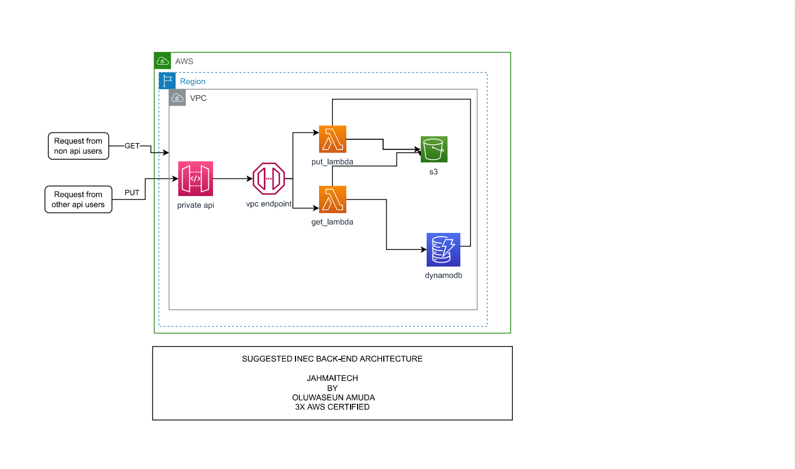

C, we can follow the steps below:

The first step is to create a data model that represents the results of an election. This data model should include information about the election, the candidate(s) running, and the results of the election.

Set up a serverless architecture: 
Next, we can use AWS Lambda, API Gateway, and DynamoDB to set up a serverless architecture for the solution. AWS Lambda can be used to run the code that will populate the DynamoDB database, and API Gateway can be used to create a RESTful API that will allow INEC officials to submit results to the database.

Create an API: 
We can create an API using API Gateway that will accept HTTP POST requests from INEC officials. The API will need to authenticate requests, validate inputs, and transform data as necessary before passing it to Lambda.

Write Lambda Function:
We can write a Lambda function in Python or another supported language that will take the data submitted by the API and use it to populate the DynamoDB database. The function can validate the input data, transform it as necessary, and write it to the appropriate table in the DynamoDB database.

Set up authentication and authorization: 
To ensure that only authorized INEC officials can submit results to the database, we can set up authentication and authorization using AWS Cognito or another service.

Test and deploy:
Finally, we can test the solution and deploy it to a production environment. We should test the solution thoroughly to ensure that it is secure, reliable, and scalable.

In summary, the solution for Nigeria INEC to automatically populate their results on a DynamoDB database involves creating a data model, setting up a serverless architecture, creating an API, writing a Lambda function, setting up authentication and authorization, and testing and deploying the solution.